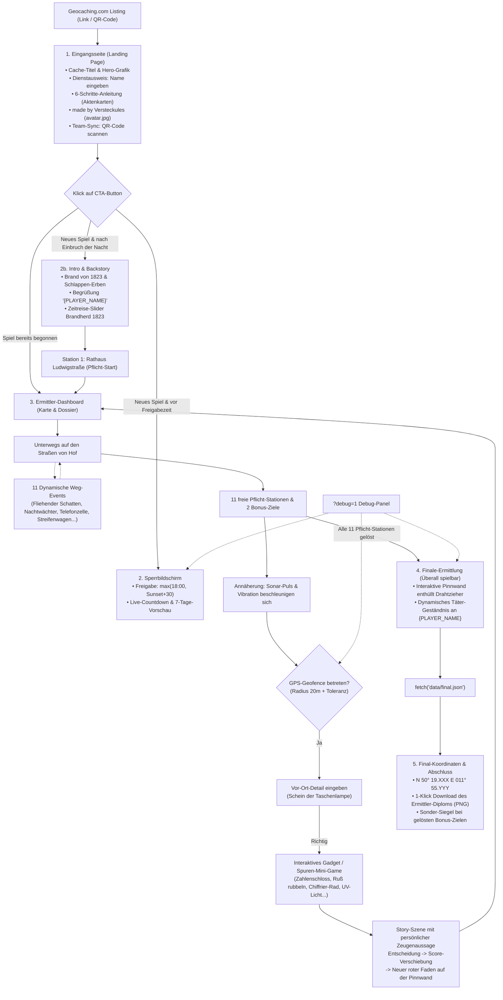

# KONZEPT – „Der Pakt der Schlappen-Erben“
Geolokalisierter Krimi-Nachtcache (Mystery/Unknown) in Hof (Saale)

> **Stand:** 05.10.2026 – Ergebnis der finalen Konzept-Abstimmung (inkl. 17 Gadgets, 11 Weg-Events, 4 Extreme-Wow-Effekten & Easter Eggs).  
> **Cache-Titel:** *„Der Pakt der Schlappen-Erben – Ein Nacht-Krimi in Hof (Saale)“*  
> **Autor/Owner:** *made by Versteckules* (Profilbild: `assets/avatar.jpg`)  
> Dieses Dokument ist die **verbindliche Gesamt-Architektur**. Abschnitt 10 enthält die Roadmap in 15 einzeln programmier- und testbaren Arbeitspaketen.

---

## 1. Entscheidungsübersicht & Kern-Vorgaben

| # | Thema | Verbindliche Festlegung |
|---|-------|-------------------------|
| 1 | Name des Caches | **„Der Pakt der Schlappen-Erben“** (Untertitel: *„Ein Nacht-Krimi in Hof (Saale)“*) |
| 2 | Eingangsseite (Landing) | **Immer erreichbar** (auch tagsüber). Zeigt Titel, High-End Hero-Cover, interaktiven Dienstausweis mit Namenseingabe, 6-Schritte-Anleitung, Owner-Badge (*made by Versteckules*) und dynamischen CTA-Button. |
| 3 | Personalisierung (Name) | **Cacher gibt Team- / Ermittler-Namen ein** (Dienstausweis auf Landing Page / im Intro). Charaktere, Zeugen und Täter sprechen den Spieler in allen Dialogen und Geständnissen dynamisch mit Namen an via `{PLAYER_NAME}` (Fallback: *„Ermittler“*). |
| 4 | Avatar & Owner-Badge | **`assets/avatar.jpg`** als Haupt-Badge in runder Messing-Fassung. **Wichtig:** Das Avatarbild soll zudem im gesamten Spiel immer wieder *sehr dezent und subtil* auftauchen (z.B. versteckt als Spiegelung, auf alten Akten im Hintergrund, als Wasserzeichen auf dem Diplom), wie ein roter Faden. |
| 5 | Grafik & Wow-Effekt | **Beste Grafik**: Eigene KI-generierte Visuals im dunklen Graphic-Novel/Noir-Stil (Bernstein/Messing auf tiefem Nachtblau). Interaktiver Taschenlampen-Lichtkegel (folgt Finger/Maus), Nebel/Glut-Canvas, Dossier-Texturen. |
| 6 | Effekte vs. Akku | **Intelligente Akku-Schonung**: Volle Effekte auf Eingangsseite, Intro und Finale; bei aktiver Karten-Navigation automatisch auf Sparflamme. Schalter in Einstellungen (*Voll / Reduziert*); Deaktivierung bei Rotlicht-Modus & *prefers-reduced-motion*. |
| 7 | Hosting | **GitHub Pages**, rein statisch (PWA), kein Server erforderlich. |
| 8 | Final-Koordinaten | Separate Datei **`data/final.json`**, **unverschlüsselt** (Cheat-Risiko bewusst akzeptiert). Jederzeit auf GitHub anpassbar. |
| 9 | Testbarkeit von zuhause | **Debug-Modus per `?debug=1`** mit Panel (Teleport, Karten-Klick als Fake-GPS, Zeit-Override, Live-Scores, Instant-Solve). |
| 10 | Tech-Stack | **Vanilla HTML5 / CSS3 / ES-Module JavaScript** (kein schwerer Build-Schritt), Leaflet + CARTO Dark Matter für die Karte. |
| 11 | Zeitsperre | Freigabe = **max(18:00, Sonnenuntergang + 30 min)**, Ende = **Sonnenaufgang**, Berechnung lokal mit SunCalc (offlinefähig). |
| 12 | Startzeit-Info | Sperrbildschirm informiert tagsüber mit **„Heute ab HH:MM Uhr“**, Live-Countdown und 7-Tage-Vorschau. |
| 13 | Reihenfolge | **Station 1 = Rathaus (fester Start)**. Danach alle übrigen 11 Stationen **völlig frei wählbar**. |
| 14 | Vor-Ort-Details | In `data/stations.json`. Fehlertolerante Eingabe, Hilfshinweis nach 3 Fehlversuchen, Antwort im Debug sichtbar. |
| 15 | GPS-Geofencing | Radius Standard **20 m**, Treffer bei `Distanz − min(Genauigkeit, 15 m) ≤ Radius`. Live-Entfernung, Kompass-Pfeil, Vibration. |
| 16 | Dynamisches Story-Routing | Absolutes Alleinstellungsmerkmal: Der Täter am Ende ist **nicht festgeschrieben**! Je nachdem, welche Dialog-Optionen man bei Zeugen wählt und in **welcher Reihenfolge** man die Open-World-Stationen anläuft (Zonen-Score), verschieben sich unsichtbare Parameter. |
| 17 | Multiple Endings (Finale) | Nach 11 Stationen berechnet die App das Profil. **Das Finale ändert sich komplett**: Der Verdächtige mit den meisten Indizien wird zum Mörder und liefert sein individuelles, dramatisches Geständnis ab (3 verschiedene Enden möglich!). |
| 18 | Story & Namen | Vollständiger KI-Erstentwurf in `data/story.json`. Fiktive heutige Verdächtige mit fiktiven Namen, historischer Hintergrund wahrheitsnah. |
| 19 | Offline-Betrieb | **PWA mit Service Worker** und `localStorage` (übersteht Neuladen/Akkuwechsel, Notfall-Reset vorhanden). |
| 20 | Nacht-Ergonomie | **Rotlicht-Modus** (Nachtsicht), **Screen Wake Lock API** (hält das Display beim Navigieren wach), große Touch-Targets (≥ 48px), haptisches Feedback. |
| 21 | Koordinaten-Format | Der Owner pflegt alle Koordinaten selbst im Format: **`N 50° 19.784 E 011° 42.485`**. |
| 22 | **Digitaler Peilsender / Sonar** | Je näher man dem 20m-Geofence kommt (ab 100m Distanz), desto **schneller pulsiert die Navigator-Anzeige optisch und haptisch (Vibrations-Ping)**. |
| 23 | **Ermittler-Pinnwand (Evidence Board)** | Im Dossier gibt es eine stilechte **Kork-Pinnwand**: Polaroids der Verdächtigen, Tatort-Skizzen und gesammelte Beweise werden mit **gespannten roten Fäden** dynamisch verknüpft. |
| 24 | **Generierbare Abschluss-Urkunde** | Nach dem Finale rendert die App ein **offizielles Dienst-Diplom** (mit Spielername, Lösungsdauer, gefasstem Täter und Siegel) mit **1-Klick-Bild-Download (PNG)** – perfekt fürs Geocaching.com-Log! |
| 25 | **Zeitreise-Bildschieber** | An historischen Meilensteinen (z. B. Brandstelle Ludwigstraße 1823 & Rathaus) ein **Vorher/Nachher-Slider**: Historischer Brand-Kupferstich von 1823 vs. heutige Nachtansicht. |
| 26 | **Polizeifunk & Sound-Atmosphäre** | Kurze, unheimliche **Funk-Geräusche (Rauschen, Piepen, Teletype-Ticken)** via leichtgewichtiger Web Audio API (keine schweren MP3s, 100% offline). Globaler Stummschalter im UI. |
| 27 | **2 Optionale Bonus-Ziele (Side-Quests)** | Neben den 12 Hauptstationen existieren **2 freiwillige Neben-Ermittlungen** (*Saale-Schmuggelroute* & *Altstadt-Archiv*). Schalten Sonder-Indizien und den Ehrentitel *„Meister-Detektiv (inkl. aller Bonus-Fälle)“* auf der Urkunde frei. |
| 28 | **Multiplayer & Team-Sync (QR-Code)** | Jedes Smartphone läuft **autark** (keine Serverkollision bei gleichzeitigen Teams). Zusätzlich: **Team-QR-Code im Menü** generiert kompakten State-Hash – ein Mitspieler scannt den Code und hat sofort denselben Spielstand (Akku-Sicherheit!). |
| 29 | **5 Easter Eggs & Geheim-Codes** | Versteckte Überraschungen für Geocacher (*Versteckules*-Name, Wärschtlamo-Kessel-Tippen, Jean-Paul-Geist, Kompass-Rundlauf, Mitternachts-Glockenschlag). |
| 30 | **17 Interaktive Ermittler-Gadgets** | Maximale Haptik & Rätselspaß: **1. Polaroid-Schütteln**, **2. Virtuelles UV-Schwarzlicht**, **3. Ruß-Freirubbeln**, **4. Retro-Geheimanruf**, **5. Drehbare Chiffrierscheibe**, **6. Kopfüber-Ambigramm**, **7. Bierdeckel-Puzzle**, **8. Aktenkoffer-Zahlenschloss**, **9. Streifenwagen-Radar**, **10. Richtmikrofon**, **11. Erpresserbrief-Puzzle**, **12. Laser-Parcours**, **13. Phantombild-Baukasten**, **14. Schleich-Schrittzähler**, **15. Wirtshaus-Würfeln**, **16. Flüster-Passwort (Spracherkennung)**, **17. Kamera-Infrarot-Scanner (WebRTC)**. |
| 31 | **11 Dynamische Weg-Events (Street-Events)** | Auf den Wegen zwischen den Stationen erwacht die Stadt zum Leben: Fliehender Schatten (90s-Sprint), Nachtwächter, Telefonzelle, Muggel-Tarnpose uvm. Bei Fehlern droht der **Display-Bruch-Jump-Scare**. |
| 32 | **4 Extreme Wow-Effekte (Native APIs)** | 1. **Flüster-Passwort** (Web Speech API), 2. **Akku-Lebensgefahr** (Battery Status API triggert Story-Event <20%), 3. **Infrarot-Kamera** (WebRTC Scanner), 4. **Display-Bruch Jump Scare** (CSS/Canvas Overlay). |
| 33 | **4 Trackable (TB) Mini-Puzzles** | Im Vorbeigehen lösbare Mini-Puzzles, die 4 reale TBs freischalten (`HQZJCG`, `EA99DB`, `CABGEW`, `CARGC7`). Werden dauerhaft in der Ermittlungsakte (Dossier) gespeichert für bequemes Loggen zuhause. |
| 34 | **Speicherung & Reset** | 100% verlässliche lokale Speicherung (`localStorage`, Offline-PWA). Im Menü gibt es einen **Reset-Button** ("Spielstand löschen") mit scharfer Sicherheits-Bestätigung ("Wirklich alles löschen?"). |

---

## 2. System- und Bildschirm-Ablauf



---

## 3. Dateistruktur

```
/Krimi
├── index.html                 # Single-Page-App Container & Shell
├── manifest.webmanifest       # PWA-Manifest (Offline/Installierbar)
├── sw.js                      # Service Worker (Cache für App, Daten, Kacheln)
├── config.js                  # Zentrale Spiel- und System-Parameter
├── KONZEPT.md                 # Verbindliche Architektur & Spezifikation
├── README.md                  # Setup, lokales Testen, GitHub Pages Deploy
├── /data
│   ├── stations.json          # 12 Hauptstationen + 2 Optionale Bonusstationen
│   ├── story.json             # Intro, 3 Verdächtige, Szenen, Entscheidungen, Enden
│   ├── events.json            # 11 dynamische Weg-Events & Zufalls-Begegnungen
│   └── final.json             # Final-Koordinaten (separat, unverschlüsselt)
├── /css
│   ├── tokens.css             # Farbpalette, Fonts, Glows, Abstände
│   ├── base.css               # Reset, Typografie, Noir-Layout, Accessibility
│   ├── components.css         # Aktenkarten, Dienstausweis, Buttons, Badges, Dossier
│   ├── board.css              # Kork-Pinnwand, Polaroids, animierte rote Fäden
│   ├── slider.css             # Zeitreise Vorher/Nachher Schieberegler
│   ├── gadgets.css            # UV-Licht, Ruß-Scratch, Kryptorad, Zahlenschloss, Laser
│   ├── events.css             # Popups für Weg-Events, Timer-Balken, Posen-Wahl
│   └── effects.css            # Lichtkegel, Nebel/Glut, Sonar-Puls, Rotlicht-Filter
├── /js
│   ├── main.js                # App-Bootstrapper, Screen-Manager, Event-Hub
│   ├── config-loader.js       # Lädt Config & JSON-Dateien mit Validierung
│   ├── coords.js              # Parser/Formatter für "N 50° 19.784 E 011° 42.485"
│   ├── timelock.js            # Berechnung Freigabe-/Endzeiten (SunCalc)
│   ├── clock.js               # Zeitquelle (Echtzeit vs. Debug-Override)
│   ├── geo.js                 # Geolocation-Watcher, Haversine, Peilung, Fake-GPS
│   ├── state.js               # Spielstand in localStorage (inkl. playerName & events)
│   ├── sync.js                # Team-Sync via kompakter QR-Code / Kurzlink Generator
│   ├── scoring.js             # Reine Score-Berechnung, Zonen-Bonus, Tiebreak
│   ├── answers.js             # Fehlertoleranter Text-/Zahlen-Vergleich
│   ├── text-formatter.js      # Ersetzt {PLAYER_NAME} und Datumsformate dynamisch
│   ├── audio.js               # Synthetisierte Funk-Sounds & Klicks (Web Audio API)
│   ├── easter-eggs.js         # Listener für geheime Interaktionen & Trigger
│   ├── debug.js               # Debug-Panel (Teleport, Fake-GPS, Fast-Forward)
│   └── /ui
│       ├── landing.js         # Eingangsseite mit Hero, Dienstausweis, Anleitung, Avatar & CTA
│       ├── lockscreen.js      # Sperrbildschirm mit Countdown & Vorschau
│       ├── intro.js           # Intro-Sequenz mit Funk-Atmo & Standort-Erlaubnis
│       ├── map.js             # Leaflet-Karte mit Dark-Theme & Custom-Markern
│       ├── navigator.js       # Peilungs-Kompass, Entfernungs-Anzeige & Sonar-Puls
│       ├── street-events.js   # Trigger- & Ablauf-Manager für die 11 Weg-Events
│       ├── station.js         # Rätselmaske, Szene, Entscheidungs-Dialog
│       ├── board.js           # Interaktive Ermittler-Pinnwand mit roten Fäden
│       ├── time-slider.js     # Historischer Vorher/Nachher-Zeitreiseschieber
│       ├── dossier.js         # Fallakte mit Beweisen, Team-Sync & Namenskorrektur
│       ├── finale.js          # Auflösungs-Zeremonie & Koordinatenausgabe
│       ├── certificate.js     # Canvas-Renderer für das Abschluss-Diplom (PNG-Export)
│       ├── effects.js         # Taschenlampen-Shader, Nebel-Canvas & Akku-Management
│       └── /gadgets
│           ├── polaroid.js    # Schüttel-Entwicklung für Polaroid-Fotos (DeviceMotion)
│           ├── uv-light.js    # Virtuelle UV-Schwarzlichtlampe mit Wisch-Geheimtinte
│           ├── scratch.js     # Ruß-Freirubbeln (Canvas-Spurensicherung)
│           ├── fake-call.js   # Retro-Telefonanruf Simulator mit Audio & Vibration
│           ├── cryptowheel.js # Drehbare Messing-Chiffrierscheibe mit Haptik
│           ├── ambigram.js    # Gyroskop-Kopfüber-Erkennung für Gemälde
│           ├── coaster.js     # Bierdeckel-Zerreiß-Puzzle (Hofer Schlappenbier)
│           ├── briefcase.js   # Aktenkoffer-Zahlenschloss mit akustischem Klick-Knacker
│           ├── wiretap.js     # Virtuelles Richtmikrofon mit animierten Schallwellen
│           ├── letter.js      # Zerrissener Erpresserbrief (Schnipsel-Puzzle)
│           ├── laser.js       # Laser-Lichtschranken-Parcours (Minigame)
│           ├── mugshot.js     # Phantombild-Baukasten (Zeugen-Gegenüberstellung)
│           ├── stealth.js     # Schleich-Schrittzähler (Beschleunigungssensor)
│           ├── dice.js        # Wirtshaus-Würfeln (Schütteln & Würfeln gegen Informant)
│           ├── whisper.js     # Flüster-Passwort (Web Speech API)
│           └── scanner.js     # Infrarot-Kamera-Scanner (WebRTC)
├── /vendor
│   ├── leaflet/               # Leaflet CSS & JS lokal (für 100% Offline-Betrieb)
│   ├── qrcode.min.js          # Ultrakompakter QR-Code-Generator (für Offline-Sync)
│   └── suncalc.js             # SunCalc Bibliothek lokal
├── /assets
│   ├── avatar.jpg             # Owner-Bild (Versteckules)
│   ├── hero_hof_night.webp    # High-End Noir Hero-Cover
│   ├── seal_schlappen.webp    # Siegel-Emblem der Schlappen-Erben
│   ├── texture_cork.webp      # Kork-Textur für die Pinnwand
│   ├── history_fire_1823.webp # Historischer Kupferstich Stadtbrand 1823
│   ├── suspect_herold.webp    # Porträt Antiquitätenhändler
│   ├── suspect_gipser.webp    # Porträt Kommunalpolitikerin
│   ├── suspect_heiden.webp    # Porträt Domorganist
│   ├── texture_paper.webp     # Dezente Aktenpapier-Hintergrundtextur
│   └── icons/                 # PWA-App-Icons (192x192, 512x512)
└── /tools
    └── simulate.mjs           # Node-Skript zur Verifikation des Score-Balancings
```

---

## 4. Spezifikation der 17 Interaktiven Ermittler-Gadgets

1. **Polaroid-Schüttel-Effekt (`polaroid.js`):** Beweisfotos schüttelnd entwickeln (DeviceMotion / Tap).
2. **Virtuelle UV-Schwarzlichtlampe (`uv-light.js`):** Fluoreszierendes Wischen über Geheimtinten.
3. **Ruß-Freirubbeln an der Brandstelle (`scratch.js`):** Asche und Ruß per Canvas destination-out freilegen.
4. **Eingehender Geheim-Anruf (`fake-call.js`):** Schock-Telefonat mit Dr. Rengers Tonband.
5. **Drehbare Messing-Chiffrierscheibe (`cryptowheel.js`):** Kryptorad mit Haptik-Klicks.
6. **Kopfüber-Ambigramm mit Gyroskop (`ambigram.js`):** Handy um 180° drehen für verborgene Inschriften.
7. **Hofer Bierdeckel-Puzzle (`coaster.js`):** 4-Teile Mini-Puzzle eines zerrissenen Schlappenbier-Deckels.
8. **Aktenkoffer-Zahlenschloss (`briefcase.js`):** Ein drehbares 3-stelliges Schloss – an der richtigen Zahl ertönt ein feiner akustischer Klick und eine feine Vibration.
9. **Virtuelles Richtmikrofon (`wiretap.js`):** An einer alten Kirchentür/Hinterhofwand lauscht man mit animierter Audio-Wellenform und hört ein geheimes Streitgespräch der Erben.
10. **Zerrissener Erpresserbrief (`letter.js`):** Ein Drohbrief an Dr. Renger in 6 Schnipseln, die man auf dem Touchscreen passgenau aneinanderschiebt.
11. **Laser-Lichtschranken (`laser.js`):** Ein gesperrter Archiv-Gang mit roten Laserstrahlen – im Slalom vorsichtig durchtippen, ohne den Alarm auszulösen.
12. **Phantombild-Baukasten (`mugshot.js`):** Nach Zeugenaussage wählt man Augen, Nase, Bart und Hut zusammen, um das Gesicht des Fliehenden zu rekonstruieren.
13. **Schleich-Schrittzähler (`stealth.js`):** 30 Schritte lautlos anschleichen – die Beschleunigungssensoren überwachen Erschütterungen. Wer zu laut stampft, muss von vorn beginnen!
14. **Wirtshaus-Würfeln (`dice.js`):** Ein Informant will ein Würfel-Duell: Smartphone schütteln, 2 Würfel rollen physikalisch über den Tisch!
15. **Historischer Zeitreise-Slider (`time-slider.js`):** Split-Slider 1823 vs. heute an den Brandstellen.
16. **Flüster-Passwort (`whisper.js`):** Web Speech API – Cacher muss das Passwort tatsächlich leise in das Handy flüstern.
17. **Infrarot-Kamera-Scanner (`scanner.js`):** WebRTC – Kamera-Feed wird mit Infrarot-Filter belegt, um versteckte Markierungen aufzuspüren.

---

## 5. Spezifikation der 11 Dynamischen Weg-Events (Street-Events)

1. **Der fliehende Schatten (Biengässchen):** 90-Sekunden-Sprint um die Ecke, um die verlorene Aktentasche zu schnappen!
2. **Der kauzige Hofer Nachtwächter (Lorenzberg):** Tritt mit Laterne in den Weg – schlagfertiger Dialog rettet vor Verwarnung.
3. **Der Wärschtlamo-Servietten-Code (Sonnenplatz):** Fettfleck auf Serviette wegwischen für Geheimzahl.
4. **Die klingelnde Telefonzelle (Karolinenstraße):** Altes Münztelefon schrillt – Anrufer warnt vor Verfolgern.
5. **Der verlorene Schlüsselbund (Lorenzpark):** Glänzt im Laub – öffnet später ein Geheimfach.
6. **Die Muggel-Tarnpose (Kreuzung):** Blitzschnell eine von 3 lustigen Posen wählen (*„Schuh binden“*, *„Fassade anstarren“*).
7. **Kreide-Symbole nachzeichnen:** Pflaster-Geheimbund-Symbol in einem Zug mit dem Finger nachfahren.
8. **Das verlassene Fahrrad:** Brand-Zeitung von 1823 in den Speichen.
9. **Funkloch-Signalsuche:** Knisterndes Signal durch 15m Weitergehen wiederherstellen.
10. **Streifenwagen-Radar:** Patrouillierender Streifenwagen taucht auf Mini-Radar auf – 10 Sekunden Handy nach unten halten („in Deckung gehen“).
11. **Lautloses Anschleichen:** Kirchhof-Schleich-Challenge (Pedometer misst Erschütterungen).

---

## 6. Die 14 Stationen im Gesamtüberblick

| Nr | ID | Typ | Station | Vor-Ort-Rätsel | Interaktives Highlight |
|:--:|---|:---:|---|---|:---:|
| 1 | `rathaus` | **Pflicht-Start** | **Rathaus Ludwigstraße** | Wappen über Portal | **Zeitreise-Slider (Rathaus 1823)** |
| 2 | `hauptbahnhof` | Pflicht | Hauptbahnhof Hof | Relief-Figuren Denkmal | **Polaroid-Schütteln + Phantombild** |
| 3 | `obelisk` | Pflicht | Obelisk / Sophienschule | Vorletzte Jahreszahl | **Aktenkoffer-Zahlenschloss** |
| 4 | `lorenzkirche` | Pflicht | Lorenzpark & Kirche | Wort Rosina-Richter | **Schleich-Schrittzähler** |
| 5 | `biengaesschen` | Pflicht | Biengässchen | Wandanker am Eckhaus | **Fliehender Schatten (Verfolgungsjagd)** |
| 6 | `ludwigstrasse` | Pflicht | Ludwigstraße 18 & 20 | Brandgedenktafel Hausnr. | **Ruß-Rubbeln + Fake-Anruf!** |
| 7 | `karolinenstrasse`| Pflicht | Karolinenstraße (Nr. 12) | Sandstein-Rosetten | **Klingelnde Telefonzelle** |
| 8 | `schlossplatz` | Pflicht | Schloßplatz 12b | Wort Jean-Paul-Tafel | **Kopfüber-Ambigramm (Gyroskop)** |
| 9 | `sonnenplatz` | Pflicht | Sonnenplatz / Wärschtlamo | Initialen Kessel-Rückseite | **Wärschtlamo-Easter-Egg & Wirtshaus-Würfeln** |
| 10 | `marienkirche` | Pflicht | St. Marien-Kirche | Zacken Stern-Maßwerk | **Richtmikrofon (Tür-Abhören)** |
| 11 | `michaeliskirche`| Pflicht | St. Michaeliskirche | Letzte Ziffer Südturm | **Messing-Chiffrierscheibe** |
| 12 | `hospitalkirche` | Pflicht | Hospitalkirche | Kreuzmotive zur Saale | **Virtuelles UV-Schwarzlicht & Laser** |
| B1 | `saale_schmuggel`| **Bonus (Opt.)** | **Saaleufer-Schmuggelpfad** | Eisenringe an Pollern | Zerrissener Erpresserbrief (+15 Pkt) |
| B2 | `altstadt_archiv` | **Bonus (Opt.)** | **Altes Spital-Archiv** | Jahreszahl Torbogen | Bundessatzung 1432 (+15 Pkt) |

---

## 7. Roadmap – 15 Arbeitspakete (AP)

Jedes Paket ist eigenständig programmierbar und mit `?debug=1` sofort von zuhause testbar.

### AP 1 – Grundgerüst, Design-System, Landing Page & High-End Grafik
- **Ziel:** SPA Container, tokens.css, base.css, components.css, effects.css. Generierung der Kern-Grafiken (`hero_hof_night.webp`, `seal_schlappen.webp`, Fallback-Avatar). Einbindung von `avatar.jpg` und *made by Versteckules*. Dienstausweis mit Namenseingabe (`playerName`). 6-Schritte-Anleitung als Aktenkarten. Taschenlampen-Lichtkegel. Web-Audio Sound-Modul mit Stummschaltung. Easter-Egg-Initialisierung.
- **Abnahme:** `index.html` startet fehlerfrei. Landing Page sieht extrem hochwertig aus. Name wird gespeichert. Anleitung klappt auf/zu.

### AP 2 – Konfiguration, Daten-Lader & Koordinaten-Engine
- **Ziel:** `config.js`, `js/config-loader.js`, `js/coords.js`. Parser für `N 50° 19.784 E 011° 42.485`. Daten-Dateien `stations.json` (12 Pflicht + 2 Bonus), `story.json`, `events.json` (11 Weg-Events), `final.json`.
- **Abnahme:** Parsing und Validierung arbeiten fehlerfrei.

### AP 3 – State-Management, Team-Sync, TB-Inventar & Reset
- **Ziel:** `js/state.js`, `js/sync.js`, `vendor/qrcode.min.js`. Speichert Name, gelöste Stationen (inkl. Bonus), getriggerte Events, Entscheidungen, Zonen-Bonus und **die 4 TB-Codes**. Implementierung eines **Reset-Buttons** mit Sicherheits-Bestätigung. QR-Code-Generator zum Exportieren auf Mitspieler-Geräte.
- **Abnahme:** Neuladen behält Fortschritt bei. Reset löscht sauber nach Bestätigung. QR-Code-Scan synchronisiert den Spielstand auf ein Zweitgerät.

### AP 4 – Nacht-Zeitsperre & Countdown-Screen
- **Ziel:** `js/timelock.js`, `js/clock.js`, `js/ui/lockscreen.js`. SunCalc-Berechnung, Live-Countdown, Startzeit *„Heute ab HH:MM“* und 7-Tage-Tabelle.
- **Abnahme:** Zeitprüfung schützt tagsüber verlässlich.

### AP 5 – Das Home-Office Debug-Panel (Vollständige Couch-Testbarkeit)
- **Ziel:** `js/debug.js` (Aktivierung per `?debug=1`). **ALLES muss von zuhause aus am PC/Handy testbar sein.**
- **Abnahme:** Teleport zu allen 14 Stationen, Zeit-Override, Instant-Solve, Sonar-Test, Gadget-Direktstarter (alle 17 Gadgets), Event-Trigger, Easter-Eggs und **TB-Fund-Simulation**.

### AP 6 – Leaflet-Karte & Dark-Noir Theme
- **Ziel:** `js/ui/map.js`. Leaflet lokal, CARTO Dark Kacheln, Pins (Start, Pflicht aktiv/gesperrt, Bonus-Stationen silber, gelöst).
- **Abnahme:** Flüssige Navigation auf der Karte. Station 1 aktiv, Pflichtstationen gesperrt, Bonusstationen frei wählbar.

### AP 7 – GPS, Geofencing, Fake-GPS & Digitaler Peilsender (Sonar)
- **Ziel:** `js/geo.js`, `js/ui/navigator.js`. Distanzberechnung, Sonar-Puls mit optischer und haptischer Beschleunigung bei Annäherung, Warnung bei schwachem GPS.
- **Abnahme:** Sonar pulsiert ab 100m, vibriert spürbar und schlägt bei 20m an. Fake-GPS im Debug-Panel testbar.

### AP 8 – Stations-Ablauf & Fehlertolerante Vor-Ort-Rätsel
- **Ziel:** `js/answers.js`, `js/ui/station.js`. Tolerante Normalisierung, Fehlversuchszähler und Hilfshinweis.
- **Abnahme:** Rätsel löst Station 1 und entriegelt die restlichen 11 Pflicht-Stationen.

### AP 9 – Die 17 Interaktiven Gadgets & die 11 Weg-Events (Street-Events)
- **Ziel:** `/js/ui/gadgets/` (17 Module, inkl. `whisper.js` & `scanner.js`) und `js/ui/street-events.js` (Verfolgungsjagd, Telefonzelle inkl. Zerspringendem-Display-Effekt bei Fehlern).
- **Abnahme:** Alle 17 Gadgets (inkl. Spracheingabe und Kamera-Scanner) und 11 Straßen-Events lassen sich einzeln und in Folge flüssig triggern und bedienen.

### AP 10 – Score-Balancing & Simulations-Engine
- **Ziel:** `js/scoring.js`, `tools/simulate.mjs`. Node.js Testlauf für 10.000 Simulationen.
- **Abnahme:** Alle 3 Täter liegen im Gleichgewicht (25–40%).

### AP 11 – Das Finale, Koordinatenausgabe & Diplom-Download
- **Ziel:** `js/ui/finale.js`, `js/ui/certificate.js`. Täter-Geständnis, Anzeige der Final-Koordinaten aus `final.json`, Canvas-Generierung des Ermittler-Diploms mit PNG-Download und Sonder-Prädikaten.
- **Abnahme:** Diplom wird maßgeschneidert gerendert und lässt sich als Bild auf das Smartphone speichern.

### AP 12 – Vollständige Story-Texte & Verdächtigen-Porträts
- **Ziel:** Alle Texte in `data/story.json` und `data/events.json`. Generierung der Verdächtigen-Porträts in `/assets`.
- **Abnahme:** Fesselnde Handlung mit konsistenter Ansprache von `{PLAYER_NAME}`.

### AP 13 – PWA-Manifest & Offline Service Worker
- **Ziel:** `manifest.webmanifest`, `sw.js`, App-Icons. Vollständiges Caching.
- **Abnahme:** 100% funktionsfähig im Flugmodus.

### AP 14 – Polish, Audio-Synthese, Easter-Eggs, Akku-Gefahr & Jump Scares
- **Ziel:** `audio.js` (Web Audio API), `easter-eggs.js`, Rotlicht-Modus. **Akku-Lebensgefahr** via Battery Status API (Flackern <20%), **Zerspringendes Display** (Canvas Overlay bei Fehler).
- **Abnahme:** Low-Battery triggert Story-Event. Easter Eggs & Jump Scares klappen perfekt.

### AP 15 – Deployment auf GitHub Pages & Listing-Dokumentation
- **Ziel:** `README.md`, Vorlage für Geocaching.com (`docs/LISTING.md`) und Begehungsleitfaden (`docs/BEGEHUNG.md`).
- **Abnahme:** Live auf GitHub Pages spielbar.
