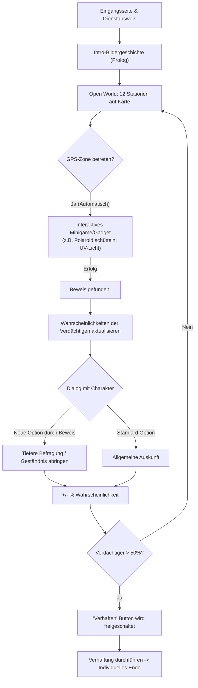

# KONZEPT – „Der Pakt der Schlappen-Erben“
Geolokalisierter Krimi-Nachtcache (Mystery/Unknown) in Hof (Saale)

> **Stand:** 06.10.2026 – "Next Level" Architektur (Komplexe Wahrscheinlichkeiten, Branching Dialogues, Gadget-Minigames, Dynamische Verhaftung).
> **Cache-Titel:** *„Der Pakt der Schlappen-Erben – Ein Nacht-Krimi in Hof (Saale)“*  
> **Autor/Owner:** *made by Versteckules* (Profilbild: `assets/avatar.jpg`)  
> Dieses Dokument ist die **verbindliche Gesamt-Architektur**. 

---

## 1. Entscheidungsübersicht & "Next Level" Kern-Vorgaben

| # | Thema | Verbindliche Festlegung |
|---|-------|-------------------------|
| 1 | Name des Caches | **„Der Pakt der Schlappen-Erben“** (Untertitel: *„Ein Nacht-Krimi in Hof (Saale)“*) |
| 2 | Eingangsseite | **Immer erreichbar**. Zeigt Titel, High-End Hero-Cover, interaktiven Dienstausweis mit Namenseingabe, Anleitung, Owner-Badge (*made by Versteckules*). |
| 3 | Personalisierung | **Cacher gibt Team- / Ermittler-Namen ein**. Charaktere sprechen den Spieler dynamisch mit `{PLAYER_NAME}` an. |
| 4 | Avatar & Owner-Badge | **`assets/avatar.jpg`** als Haupt-Badge. Avatarbild taucht subtil als Easter-Egg auf (Spiegelung, Wasserzeichen). |
| 5 | Grafik & Ästhetik | **Beste Grafik**: Graphic-Novel/Noir-Stil. Bildergeschichte mit animierten Elementen (GIF/SVG) an jeder Station. Keine simplen Textwüsten. |
| 6 | **Trigger via GPS** | **Keine manuelle Text-Eingabe zur Stationsüberprüfung!** Wer die GPS-Zone betritt, löst die Station aus ("Wer bescheißen will, findet einen Weg"). |
| 7 | **Gadget-Zwang pro Station** | An **jeder** der 12 Stationen **MUSS zwingend ein interaktives Gadget / Minigame** absolviert werden, bevor es in den Dialog geht. (Schütteln, Rubbeln, Puzzeln, etc. - kein "Me-Too"-Abklicken). |
| 8 | **Dynamische Wahrscheinlichkeiten** | Jeder Hauptverdächtige hat einen Wahrscheinlichkeitswert (0-100%). Dieser Wert **ändert sich dynamisch** bei jedem gefundenen Beweis und nach jeder Dialogentscheidung. |
| 9 | **Komplexe Branching-Dialoge** | **Keine linearen Storys!** Verschachtelte Dialogbäume. Das Finden von Beweisen schaltet neue Dialogoptionen bei Verdächtigen frei. Man muss mehrmals zu Charakteren zurückkehren können. |
| 10| **Verhaftungs-Mechanik** | Ein großer **"Verhaften" Button** wird aktiv, sobald ein Verdächtiger **> 50% Wahrscheinlichkeit** erreicht hat. Ist man am Ende aller Stationen und niemand hat 50%, kann man den mit dem höchsten Wert verhaften. |
| 11| Multiple Endings | Das Finale ändert sich komplett basierend darauf, wen man verhaftet (3 verschiedene Enden möglich!). |
| 12| **Ermittler-Pinnwand** | Dossier als TV-Style Evidence Board. Polaroids der Verdächtigen werden dynamisch mit gesammelten Beweisen (rote Fäden) visuell verknüpft. |
| 13| **Easter Eggs** | 5 feste Easter Eggs (Versteckules-Name, Wärschtlamo-Kessel, Jean-Paul, Kompass-Rundlauf, Glockenschlag) müssen ins Gameplay verwoben sein. |
| 14| Offline & PWA | 100% PWA, lokaler localStorage-State. Kein Server nötig. |

---

## 2. System- und Gameplay-Ablauf ("Next Level" Flow)

---

## 3. Dynamisches State- & Story-Management

Das Kernstück der App ist die `state.js` in Verbindung mit der `story.json`.

**State-Variablen:**
- `suspects`: `{ herold: 15, gipser: 10, heiden: 20 }` (Aktuelle Wahrscheinlichkeit in %)
- `evidence`: `['ruß_probe', 'schluessel', 'kontoauszug']` (Gefundene Beweise)
- `visited_stations`: `['rathaus', 'lorenzkirche']`
- `dialogue_flags`: `['asked_herold_about_fire', 'knows_about_debt']`

**Dialog-Engine (Verschachtelt):**
Ein Dialog-Knoten in `story.json` hat Bedingungen (`requires_evidence`) und Konsequenzen (`effects`).
- Beispiel: Option "Was wissen Sie über den Schlüssel?" taucht **nur** auf, wenn `evidence` den Wert `schluessel` enthält.
- Konsequenz: Wenn geklickt, steigt die Wahrscheinlichkeit für Herold um 15% (`effects: { addProb: { herold: 15 } }`).

---

## 4. Die 17 Interaktiven Ermittler-Gadgets (Zwingend als Minigame!)

An jedem Standort MUSS der Spieler erst agieren, bevor der Dialog startet. Kein reines Text-Klicken.

1. **Polaroid-Schütteln (`polaroid.js`):** Beweisfotos schüttelnd entwickeln (DeviceMotion).
2. **UV-Schwarzlichtlampe (`uv-light.js`):** Fluoreszierendes Wischen über Geheimtinten.
3. **Ruß-Freirubbeln (`scratch.js`):** Canvas Scratch-Card Effekt an Brandstellen.
4. **Retro-Geheimanruf (`fake-call.js`):** Audio-Anruf Simulator.
5. **Messing-Chiffrierscheibe (`cryptowheel.js`):** Kryptorad mit Haptik.
6. **Kopfüber-Ambigramm (`ambigram.js`):** DeviceOrientation API.
7. **Bierdeckel-Puzzle (`coaster.js`):** Drag & Drop Puzzle.
8. **Aktenkoffer-Zahlenschloss (`briefcase.js`):** 3D-CSS Drehschloss.
9. **Richtmikrofon (`wiretap.js`):** Audio-Wellenformen suchen.
10. **Erpresserbrief-Schnipsel (`letter.js`):** Puzzle.
11. **Laser-Parcours (`laser.js`):** Touch-Geschicklichkeit.
12. **Phantombild (`mugshot.js`):** Gesichter-Baukasten.
13. **Schleich-Schrittzähler (`stealth.js`):** DeviceMotion Pedometer.
14. **Wirtshaus-Würfeln (`dice.js`):** Physik-Würfelspiel.
15. **Zeitreise-Slider (`time-slider.js`):** Vorher/Nachher Bilder.
16. **Flüster-Passwort (`whisper.js`):** Web Speech API.
17. **Infrarot-Scanner (`scanner.js`):** Kamera-Zugriff.

---

## 5. Roadmap & Architektur-Refactoring (Next Steps)

Um den Anforderungen gerecht zu werden, muss das aktuelle System stark umgebaut werden:

1. **Entfernen der manuellen Texteingaben:** Die Check-Logik in `station.js` wird auf reines GPS-Geofencing (oder Klick in der Dev-Umgebung) umgestellt.
2. **Probability-Engine bauen:** `state.js` erweitern, um Wahrscheinlichkeiten (%) pro Verdächtigem zu tracken und UI (Dossier) dynamisch upzudaten.
3. **Verhaftungs-Logik:** Im Dossier den dicken 50%-Button implementieren.
4. **Branching Story Editor:** `story.json` radikal umbauen, um Knoten mit `requires` (Beweise) und `effects` (Wahrscheinlichkeits-Shift) zu unterstützen.
5. **Gadget-Integration erzwingen:** Der Flow an einer Station wird strikt: `GPS-Trigger -> Gadget Minigame -> Dialog mit Branching`.
