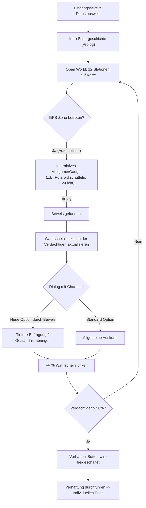

# KONZEPT – „Der Pakt der Schlappen-Erben“
Geolokalisierter Krimi-Nachtcache (Mystery/Unknown) in Hof (Saale)
*Umfang: 16 Stationen (ca. 3 - 4 Kilometer, 2 bis 3 Stunden Spieldauer)*

> **Stand:** 06.10.2026 – "Next Level" Architektur (Komplexe Wahrscheinlichkeiten, Branching Dialogues, Gadget-Minigames, Dynamische Verhaftung).
> **Cache-Titel:** *„Der Pakt der Schlappen-Erben – Ein Nacht-Krimi in Hof (Saale)“*  
> **Autor/Owner:** *made by Versteckules* (Profilbild: `assets/avatar.jpg`)  
> Dieses Dokument ist die **verbindliche Gesamt-Architektur**. 

---

## 1. Entscheidungsübersicht & "Next Level" Kern-Vorgaben

| # | Thema | Verbindliche Festlegung |
|---|-------|-------------------------|
| 1 | Name des Caches | **„Der Pakt der Schlappen-Erben“** (Untertitel: *„Ein Nacht-Krimi in Hof (Saale)“*) |
| 2 | Eingangsseite | **Immer erreichbar**. Zeigt Titel, High-End Hero-Cover, interaktiven Dienstausweis mit Namenseingabe, Anleitung, Owner-Badge (*made by Versteckules*). |
| 3 | Personalisierung | **Cacher gibt Team- / Ermittler-Namen ein**. Charaktere sprechen den Spieler dynamisch mit `{PLAYER_NAME}` an. |
| 4 | Avatar & Owner-Badge | **`assets/avatar.jpg`** als Haupt-Badge. Avatarbild taucht subtil als Easter-Egg auf (Spiegelung, Wasserzeichen). |
| 5 | Grafik & Ästhetik | **Beste Grafik**: Graphic-Novel/Noir-Stil. Bildergeschichte mit animierten Elementen (GIF/SVG) an jeder Station. Keine simplen Textwüsten. |
| 6 | **Trigger via GPS** | **Keine manuelle Text-Eingabe zur Stationsüberprüfung!** Wer die GPS-Zone betritt, löst die Station aus ("Wer bescheißen will, findet einen Weg"). |
| 7 | **Gadget-Zwang pro Station** | An **jeder** der 12 Stationen **MUSS zwingend ein interaktives Gadget / Minigame** absolviert werden, bevor es in den Dialog geht. (Schütteln, Rubbeln, Puzzeln, etc. - kein "Me-Too"-Abklicken). |
| 8 | **Dynamische Wahrscheinlichkeiten** | Jeder Hauptverdächtige hat einen Wahrscheinlichkeitswert (0-100%). Dieser Wert **ändert sich dynamisch** bei jedem gefundenen Beweis und nach jeder Dialogentscheidung. |
| 9 | **Komplexe Branching-Dialoge** | **Keine linearen Storys!** Verschachtelte Dialogbäume. Das Finden von Beweisen schaltet neue Dialogoptionen bei Verdächtigen frei. Man muss mehrmals zu Charakteren zurückkehren können. |
| 10| **Verhaftungs-Mechanik** | Ein großer **"Verhaften" Button** wird aktiv, sobald ein Verdächtiger **> 50% Wahrscheinlichkeit** erreicht hat. Ist man am Ende aller Stationen und niemand hat 50%, kann man den mit dem höchsten Wert verhaften. |
| 11| Multiple Endings | Das Finale ändert sich komplett basierend darauf, wen man verhaftet (3 verschiedene Enden möglich!). |
| 12| **Ermittler-Pinnwand** | Dossier als TV-Style Evidence Board. Polaroids der Verdächtigen werden dynamisch mit gesammelten Beweisen (rote Fäden) visuell verknüpft. |
| 13| **Easter Eggs** | 5 feste Easter Eggs (Versteckules-Name, Wärschtlamo-Kessel, Jean-Paul, Kompass-Rundlauf, Glockenschlag) müssen ins Gameplay verwoben sein. |
| 14| Offline & PWA | 100% PWA, lokaler localStorage-State. Kein Server nötig. |

---

## 2. System- und Gameplay-Ablauf ("Next Level" Flow)

---

## 3. Dynamisches State- & Story-Management

Das Kernstück der App ist die `state.js` in Verbindung mit der `story.json`.

**State-Variablen:**
- `suspects`: `{ herold: 15, gipser: 10, heiden: 20 }` (Aktuelle Wahrscheinlichkeit in %)
- `evidence`: `['ruß_probe', 'schluessel', 'kontoauszug']` (Gefundene Beweise)
- `visited_stations`: `['rathaus', 'lorenzkirche']`
- `dialogue_flags`: `['asked_herold_about_fire', 'knows_about_debt']`

**Dialog-Engine (Verschachtelt):**
Ein Dialog-Knoten in `story.json` hat Bedingungen (`requires_evidence`) und Konsequenzen (`effects`).
- Beispiel: Option "Was wissen Sie über den Schlüssel?" taucht **nur** auf, wenn `evidence` den Wert `schluessel` enthält.
- Konsequenz: Wenn geklickt, steigt die Wahrscheinlichkeit für Herold um 15% (`effects: { addProb: { herold: 15 } }`).

---

## 4. Die 17 Interaktiven Ermittler-Gadgets (Zwingend als Minigame!)

An jedem Standort MUSS der Spieler erst agieren, bevor der Dialog startet. Kein reines Text-Klicken.

1. **Polaroid-Schütteln (`polaroid.js`):** Beweisfotos schüttelnd entwickeln (DeviceMotion).
2. **UV-Schwarzlichtlampe (`uv-light.js`):** Fluoreszierendes Wischen über Geheimtinten.
3. **Ruß-Freirubbeln (`scratch.js`):** Canvas Scratch-Card Effekt an Brandstellen.
4. **Retro-Geheimanruf (`fake-call.js`):** Audio-Anruf Simulator.
5. **Messing-Chiffrierscheibe (`cryptowheel.js`):** Kryptorad mit Haptik.
6. **Kopfüber-Ambigramm (`ambigram.js`):** DeviceOrientation API.
7. **Bierdeckel-Puzzle (`coaster.js`):** Drag & Drop Puzzle.
8. **Aktenkoffer-Zahlenschloss (`briefcase.js`):** 3D-CSS Drehschloss.
9. **Richtmikrofon (`wiretap.js`):** Audio-Wellenformen suchen.
10. **Erpresserbrief-Schnipsel (`letter.js`):** Puzzle.
11. **Laser-Parcours (`laser.js`):** Touch-Geschicklichkeit.
12. **Phantombild (`mugshot.js`):** Gesichter-Baukasten.
13. **Schleich-Schrittzähler (`stealth.js`):** DeviceMotion Pedometer.
14. **Wirtshaus-Würfeln (`dice.js`):** Physik-Würfelspiel.
15. **Zeitreise-Slider (`time-slider.js`):** Vorher/Nachher Bilder.
16. **Flüster-Passwort (`whisper.js`):** Web Speech API.
17. **Infrarot-Scanner (`scanner.js`):** Kamera-Zugriff.

---

## 5. Roadmap & Architektur-Refactoring (Next Steps)

Um den Anforderungen gerecht zu werden, muss das aktuelle System stark umgebaut werden:

1. **Entfernen der manuellen Texteingaben:** Die Check-Logik in `station.js` wird auf reines GPS-Geofencing (oder Klick in der Dev-Umgebung) umgestellt.
2. **Probability-Engine bauen:** `state.js` erweitern, um Wahrscheinlichkeiten (%) pro Verdächtigem zu tracken und UI (Dossier) dynamisch upzudaten.
3. **Verhaftungs-Logik:** Im Dossier den dicken 50%-Button implementieren.
4. **Branching Story Editor:** `story.json` radikal umbauen, um Knoten mit `requires` (Beweise) und `effects` (Wahrscheinlichkeits-Shift) zu unterstützen.
5. **Gadget-Integration erzwingen:** Der Flow an einer Station wird strikt: `GPS-Trigger -> Gadget Minigame -> Dialog mit Branching`.

---

## 6. Erweiterte Spezial-Spiele ("Boss-Kämpfe" & Intro-Alternativen)

Neben den Standard-Gadgets an den 12 Stationen gibt es maßgeschneiderte, aufwändigere Blockbuster-Spiele (5-10 Minuten), die den Ermittlungsfluss dynamisch erweitern.

### A. Intro-Entscheidung an Station 1 (Rathaus Brandherd)
Die Wahl des Gesprächspartners direkt zu Beginn triggert unterschiedliche Intro-Minispiele und liefert unterschiedliche Beweisstücke:
- **Die Kamera des Reporters (Paul Stift):** Der Spieler fokussiert ein verschwommenes Foto per Slider. 
  - *Ergebnis:* Enthüllt Gipsers flüchtende schwarze Limousine (Kennzeichen HO-KG 1823) -> \`foto_gipser_auto\`.
- **Das rußige Notenblatt (Kommissar Stahl):** Der Spieler rubbelt den Ruß von einem gefundenen Blatt ab (Canvas Scratch-Off). 
  - *Ergebnis:* Enthüllt die Noten B-A-C-H und verweist auf St. Michaelis -> \`notenblatt_heiden\`.

### B. Die großen Final-Spiele bei den Hauptverdächtigen
Wenn der Spieler auf der Karte die drei Hauptverdächtigen verhört, triggern nach dem Dialog große Boss-Spiele ("on top"), die massive Auswirkungen auf die Schuld-Prozente (+15%) haben:
1. **Der historische Tresor (Valentin Herold):** 
   - *Mechanik:* Ein Tresorrad, das per Gyrosensor (\`deviceorientation\` Neigung des Handys) oder Buttons gedreht wird, um die Kombination 18-23-0 einzugeben.
   - *Folge:* Enthüllt belastende Überweisungsbelege.
2. **Die Brand-Rekonstruktion / Schredder (Katharina von Gipser):** 
   - *Mechanik:* Ein interaktives 3x3 Touch-Puzzle, um zerrissene Verträge aus dem Schredder / Brand wieder zusammenzufügen.
   - *Folge:* Enthüllt den wahren Begünstigten des Pakts.
3. **Das Musikalische Kryptex (Severin Heiden):** 
   - *Mechanik:* Eine spielbare, virtuelle Orgel-Tastatur mit echten Tönen (Web Audio API), auf der B-A-C-H gespielt werden muss, um ein 4-stelliges Zylinder-Kryptex ("PAKT") freizulegen.
   - *Folge:* Enthüllt fanatische theologische Schriften.

### C. Interaktive Verhör-Verbindungen (Nebencharaktere)
Um die Welt lebendiger zu machen und die Verdachtsprozente dynamisch zu steigern, können Nebencharaktere in Kreuzverhören in die Enge getrieben werden. Dies schaltet neue Beweise frei:
1. **Wachmann Rolf (Ludwigstraße) & Herold:**
   - *Korruption:* Verwickelt man Rolf in Widersprüche, gesteht er, von Herold bestochen worden zu sein.
   - *Beweis:* \`beweis_antike_uhr\` (Goldene Taschenuhr) -> +15% Herold.
2. **Nachtkurier Sepp (Hauptpost) & Gipser:**
   - *Unwissentlicher Komplize:* Drängt man Sepp wegen der unmarkierten Kisten in die Ecke, gibt er illegale Transporte für das Bauamt zu.
   - *Beweis:* \`beweis_frachtpapiere\` (Lieferschein) -> +15% Gipser.
3. **Wärschtlamo Karl (Sonnenplatz) & Heiden:**
   - *Unwissentlicher Zeuge:* Fragt man Karl nach unheimlichen Gestalten, erinnert er sich an einen fanatischen Prediger in Schwarz.
   - *Beweis:* \`beweis_chorknaben_notiz\` (Zettel mit lateinischen Gesängen) -> +15% Heiden.
4. **Pfarrer Klement (Lorenzkirche) & Heiden:**
   - *Direkter Komplize:* Konfrontiert man den Pfarrer mit historischen Fakten, bricht er zusammen und verrät seinen spirituellen Meister.
   - *Beweis:* \`beweis_pakt_ring\` (Sekten-Siegelring) -> +15% Heiden.

### D. Audiovisuelle Inszenierung (FX & Animationen)
Das Spiel wurde durch ein eigenes `fx.js` Modul und erweiterte CSS-Animationen ("Polish") lebendiger gestaltet, um die Atmosphäre während der Verhöre zu intensivieren:

1. **Dynamische Procedural-Musik (Web Audio API):**
   - Spricht der Ermittler mit einem Hauptverdächtigen, wird die generelle MP3-Hintergrundmusik automatisch geduckt (smooth fade out).
   - *Valentin Herold:* Eine tiefe, dröhnende Sinus-Frequenz (45Hz) untermalt das Gespräch, um Gier und dunkle Macht zu suggerieren.
   - *Katharina von Gipser:* Ein kühler, pulsierender elektronischer Herzschlag (Triangle Wave + LFO) vermittelt klinische Berechnung und Stress.
   - *Severin Heiden:* Eine unheimliche zweistimmige Kirchenorgel-Atmosphäre (Square Wave auf tiefem H) spiegelt seinen religiösen Fanatismus wider.
2. **UI-Animationen:**
   - *Atmende Avatare:* Die Charakter-Porträts skalieren sanft und pulsieren in der Helligkeit, um "lebendig" zu wirken.
   - *Seiten-Transitions:* Ansichten (Karte, Dossier, Dialog) sliden weich (400ms Ease) von unten herein, anstatt hart umzuschalten.
   - *Button-Shake:* Das Treffen einer kritischen Entscheidung im Dialog löst ein Zittern (Shake-Animation) des Buttons aus, gekoppelt mit einem spürbaren mechanischen "Klack"-Sound.
3. **Visuelle Hintergrundeffekte:**
   - Am Brandherd (Rathaus) steigen animierte, glühende Aschepartikel in Form kleiner CSS-Kreise im Hintergrund des Verhörbildschirms empor.

### E. Kommissar-Ränge & Dynamischer Schwierigkeitsgrad
Mit dem Sammeln von Beweisen und dem Lösen von Stationen sammelt der Spieler *Kommissarpunkte*. Daraus resultiert ein Rang, der sichtbar im Dashboard (Karte) angezeigt wird und direkten Einfluss auf die Mechanik hat:

**Die Ränge:**
1. **Streifenpolizist** (0 - 49 Punkte)
2. **Schnüffler** (50 - 99 Punkte)
3. **Privatdetektiv** (100 - 149 Punkte)
4. **Inspektor** (150 - 199 Punkte)
5. **Sherlock Holmes** (200+ Punkte)

**Vor- und Nachteile (Dynamik):**
- **Vorteil ("Sherlock-Tipp"):** Ab Rang 3 (Privatdetektiv) schaltet sich auf der Übersichtskarte ein roter *Sherlock-Tipp*-Button frei. Klickt man darauf, erhält man basierend auf dem eigenen Spielfortschritt einen präzisen Hinweis, an welchem Ort man als Nächstes ermitteln sollte.
- **Nachteil ("Misstrauen der Zeugen"):** Niedrige Ränge werden von den Verdächtigen unterschätzt. Sie verplappern sich leichtfertig im Dialog. Erreicht der Spieler jedoch Rang 3 oder höher, wissen die Zeugen, mit wem sie es zu tun haben. Sie werden misstrauisch und blocken ab. Schwere/Brisante Dialog-Optionen tauchen ab dann *nur* noch auf, wenn der Spieler den passenden Gegenstand (Beweis) tatsächlich im Inventar hat.
